# Elite M1

This is the release repository for Elite M1, the completely unofficial and free Windows App for the Yi M1 mirrorless camera.

This App is currently in Beta, and thus the functionality is fairly rudimentary and bug-heavy.

Currently you can only view and save (either one at a time or in pages of 12) your photos over WiFi after pairing via Bluetooth (just like how the Android app works, and the iOS app used to...).

## Future Plans

- Porting this to iOS so we have a *working* iOS app for the Yi M1 once more.
- Implementing remote view / shooting capability.
- Various bug / stability / performance fixes.

## Usage Instructions

First, turn on your Yi M1 (with Bluetooth enabled).

You may need to click the button to refresh the list for it to appear.

Once it does, click Pair.

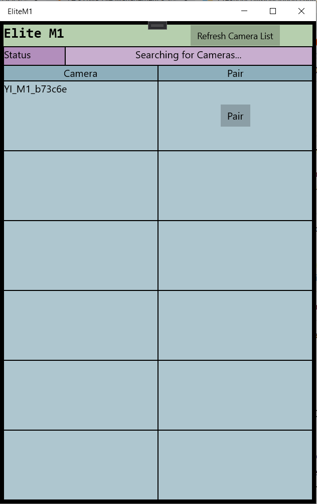

You must accept pairing on the device **BEFORE** you proceed to click close on the following dialog otherwise it will try to turn on the Camera's WIFI and this freezes the camera (not my fault, that's just how the Camera works)...

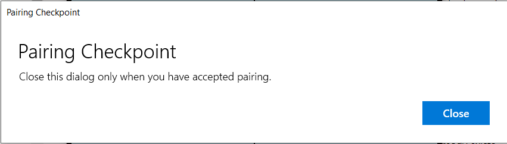

After passing the pairing checkpoint, you'll be presented with a WIFI Checkpoint, asking you to connect to your Camera's WIFI network before proceeding.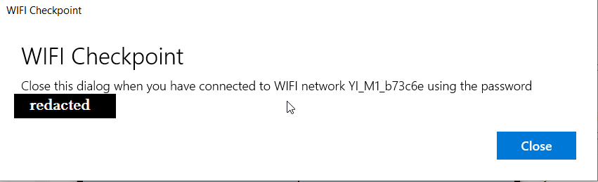

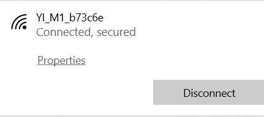

You should now be presented with the first page of your photos.

You can browse through pages of your photos with the "Next" and "Prev" buttons.

If you like, you can save and entire page of photos with the "Save Page" button.

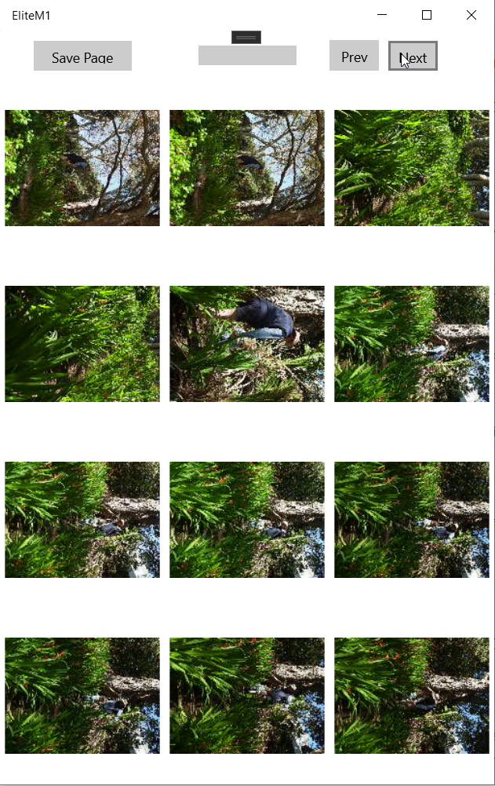

Saving progress will be shown by the progress bar at the top.

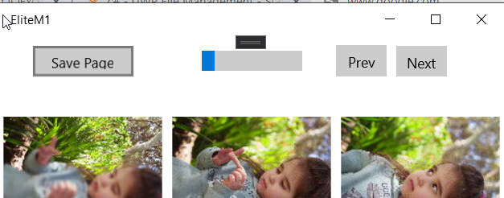

Due to limitations of the App framework used (for easy porting to iOS in the future) pictures will automatically save to your Downloads under an EliteM1 folder.

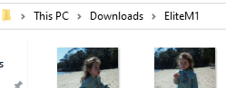

Clicking on an individual photo will let you preview that photo at its full resolution, giving you the option of just saving that individual photo.

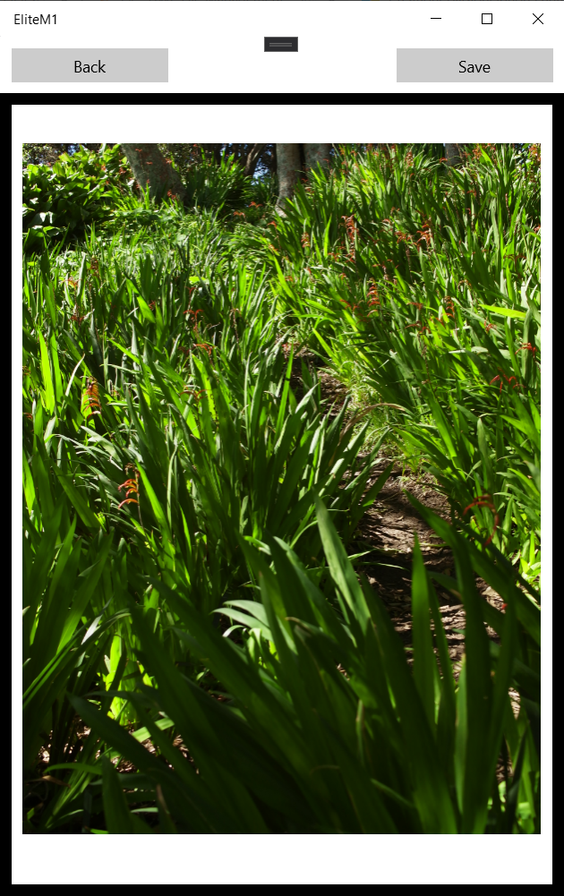

## Installation

Installation is a bit of a pain because I made the stupid decision to make this with UWP, but here goes...

First, extract the release zip.

Next, you'll need to install the included certificate (EliteM1Packaging_1.0.1.0_x86.cer) by first double clicking it, then clicking "Install Certificate...".

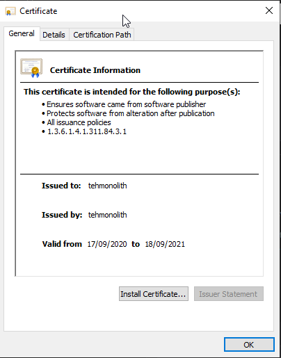

Next you'll need to choose "Local Machine" before clicking "Next".

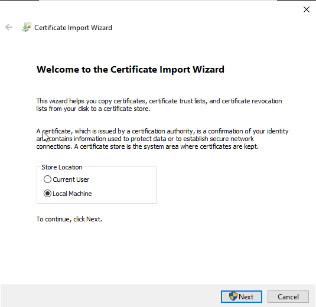

Then choose to store the certificate under "Trusted People" (you trust me, right?).

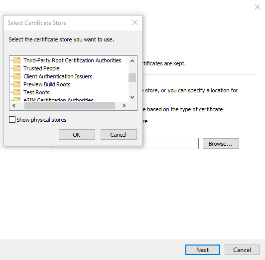

Finally click through to the end before double-clicking **EliteM1Packaging_1.0.1.0_x86.appxbundle** to install it.

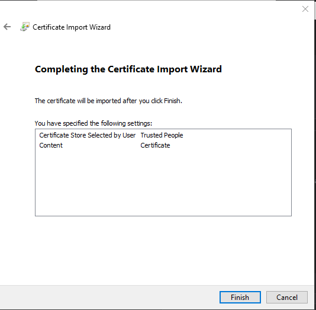